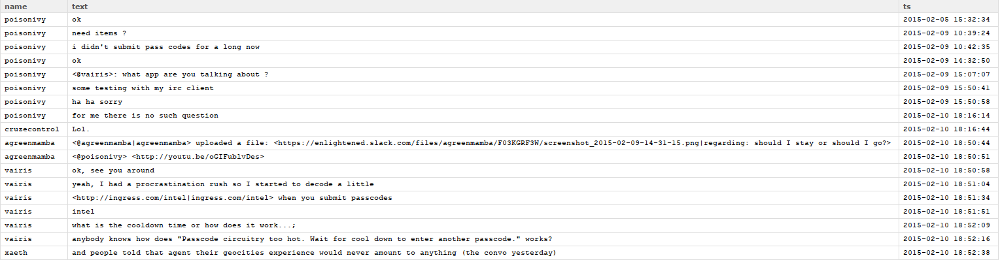

# R-slacklog
Fetch Slack message history, tidy the data set, stock in a DB or show the messages,
browse and search history.

## changelog
* version 0.3:
    + install needed libraries if not already installed
    + use data.table package
    + order messages with 8 digit seconds and print with 2 digits only
* version 0.2 : take into account the six digits after the dot in epoch time.
* version 0.1 

## logHistory.R
This script will fetch slack history for a specified channel and time frame, tidy
the data set and save it as a data table R object. This object will thereafter be
processed.

### data frame screenshot

## TO DO
* add some more options to log.history.R
* write Linux script
* write codebook
* write a function log.history() with channel, start time, end time as history 
message arguments
* connect to Elastic search

## Ressources
### R and Python

* [python package rpy2](http://rpy.sourceforge.net/): provide a low-level interface to 
**R** _from_ **Python**
* [R package rPython](http://rpython.r-forge.r-project.org/): allow the user to
call **Python** _from_ **R**

### R and Elasticsearch 

* [elastic guide](http://www.elastic.co/guide/en/elasticsearch/reference/current/index.html):
reference guide from elastic website
* [Elasticsearch from R](http://recology.info/2015/01/elasticsearch/): recology.info 
article
* [elastic R package](https://github.com/ropensci/elastic): **R** client for the Elasticsearch
HTTP API

